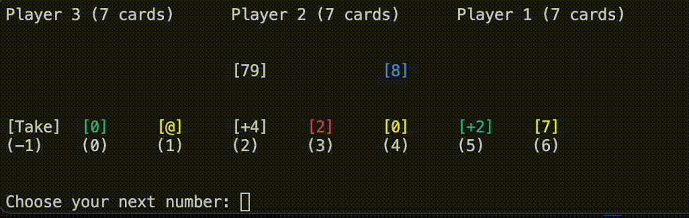
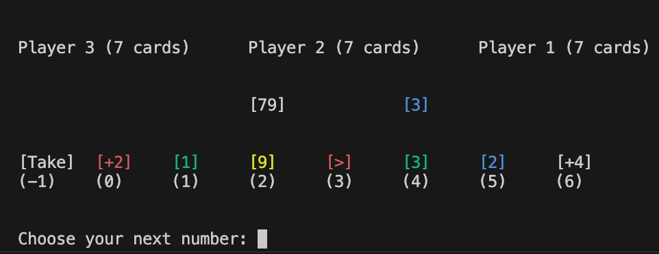

# Uno Game Terminal

## Overview

This project is a command-line implementation of the classic Uno card game. It allows multiple players to play Uno in a terminal environment with support for various game rules and functionalities.





## Project Structure

- `src/`
  - `index.js`: The main entry point for the Uno game.
  - `Uno.js`: Contains the core game logic and mechanics.
  - `Player.js`: Defines the `Player` class and related methods.
  - `Rules.js`: Defines the game rules and constants.
  - `Utils.js`: Utility functions used across the project.
  - `Screen.js`: Functions for printing game state and card details to the terminal.
  - `cards/`
    - `Types.js`: Card type definitions.
    - `Colors.js`: Color constants for the cards.
    - `Numbers.js`: Numeric values for the cards.
    - `Cards.js`: Generates the full deck of Uno cards.

## Prerequisites

You need Node and npm installed.
This project has been tested using the following versions:

- Node: v20.12.1
- npm: 10.5.0

## Installation

To install the necessary dependencies, run:

```bash
npm install
```

## Usage

To start the Uno game, run:

```bash
npm start
```

## Code Documentation

### Core Classes

#### `Uno`

The `Uno` class manages the game state and player interactions. It handles game logic such as dealing cards, managing turns, and applying game rules.

**Constructor:**

```javascript
constructor(playerSize, rules);
```

- `playerSize` (number): The number of players in the game.
- `rules` (array): An array of rules to apply to the game.

**Methods:**

- `takeCard(isFirstCard)`: Draws a card from the deck.
- `nextStep()`: Advances to the next step in the game.
- `humanMovement(cardIndex)`: Handles the movement for a human player.
- `playerMovement(playerCard)`: Processes a card played by a player.
- `getActualDeckCard()`: Returns the top card of the deck.
- `hasRule(rule)`: Checks if a specific rule is applied.

### `Player`

The `Player` class represents a player in the game, managing their cards and actions.

**Constructor:**

```javascript
constructor(id, name, isHuman);
```

- `id` (number): The player's unique identifier.
- `name` (string): The player's name.
- `isHuman` (boolean): Whether the player is a human.

**Methods:**

- `addCard(card)`: Adds a card to the player's hand.
- `removeCard(card)`: Removes a card from the player's hand.
- `removeCardIndex(cardIndex)`: Removes a card at a specific index.
- `simulateMovement(uno)`: Simulates the player's move in a non-human mode.
- `hasT2orT4()`: Checks if the player has +2 or +4 cards.
- `selectRandomColor(currentColor)`: Selects a random color, excluding the current color.

### Utility Functions

- `randomizeArray(array)`: Shuffles the elements of an array.
- `removeElementAtIndex(array, index)`: Removes an element at a specific index from an array.
- `removeElement(array, element)`: Removes a specific element from an array.
- `isNumeric(str)`: Checks if a string represents a numeric value.
- `sleep(ms)`: Pauses execution for a specified number of milliseconds.

### Card Types and Colors

- `Types.js`: Contains constants for card types such as NUMBER, REVERSE, SKIP, etc.
- `Colors.js`: Contains constants for card colors such as RED, GREEN, BLUE, YELLOW.

### Printing Functions

- `printBoard(uno)`: Prints the current state of the board.
- `printColor(color, str)`: Prints a string in the specified color.
- `getColor(color)`: Returns the ANSI escape code for a specified color.

## Contributing

Feel free to contribute by submitting pull requests or opening issues. Your contributions help improve the game and its features!

## License

This project is licensed under the ISC License. See the [LICENSE](LICENSE) file for details.
